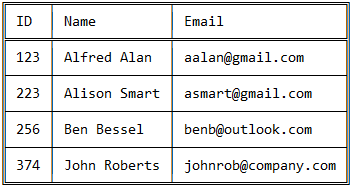
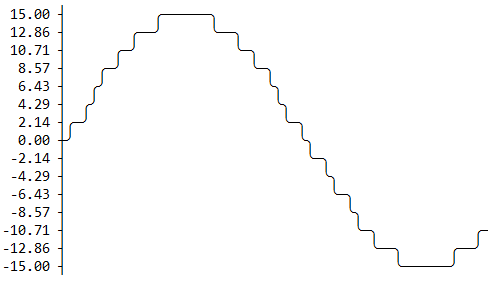

# ASCII-Data

A small Swift library for producing nice looking text-based line-graphs and tables. (Not necessarily in ASCII). It is a Java port with [JavApi⁴Swift](https://github.com/bastie/JavApi4Swift)

## Thanks

Thanks to original Java version of [ASCII-Data](https://github.com/MitchTalmadge/ASCII-Data) from MitchTalmadge

## Installation, Usage, Help, and more!

Please view  [the Java Wiki](https://github.com/MitchTalmadge/ASCII-Data/wiki)! You'll find everything you need to get started using this library. 

## License

ASL2.0
